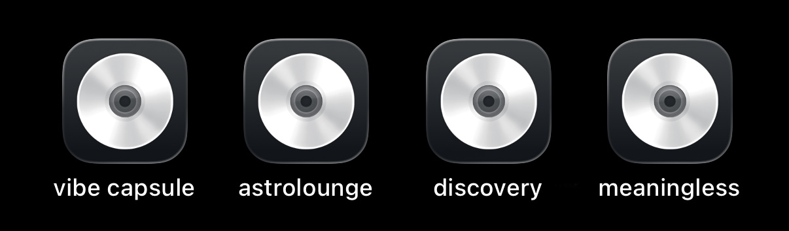
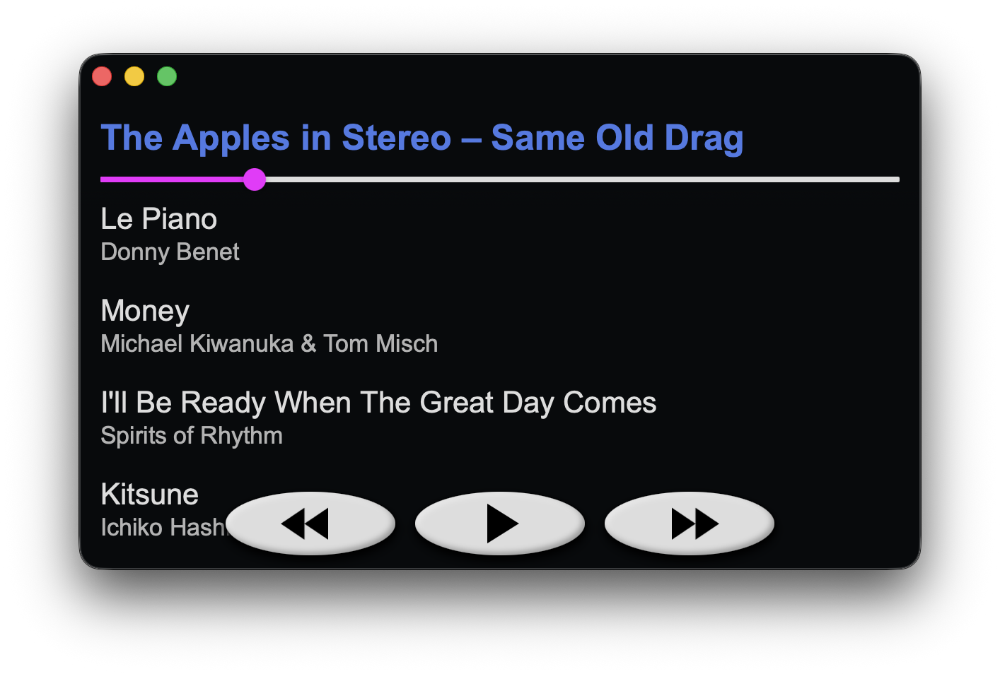
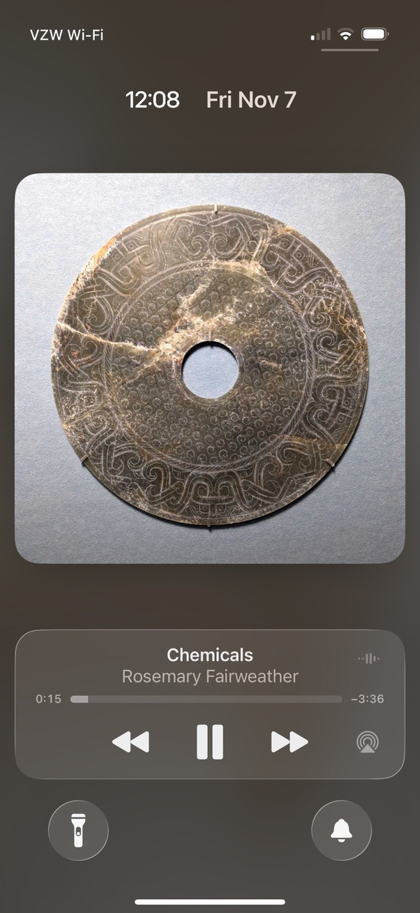

# 💿 vibe capsule

resurrect the lost art of <a href="https://ihavethatonvinyl.com/liner-notes/the-lost-art-of-the-mixtape/">mixtape</a><a href="https://melos.audio/blogs/information/the-lost-art-of-the-mixtape">-making</a> by packaging folders of .mp3s as progressive web apps.

	

## demo
<a href="https://hunterirving.com/vibe_capsule">public domain beats to code to ↗</a>

## key features
- mixtapes as self-contained apps that work completely offline on Windows, MacOS, Linux, iOS, and Android
- lock screen media controls (iOS & Android) and keyboard media key support (▶️, ⏸️, ⏭️, ⏮️)
- highly customizable interface (just add CSS)

	

## own something and be happy
modern playlist sharing is ephemeral and platform-locked. shared playlists often require a paid subscription, can be modified after sharing, and decay as licenses expire.
> [!WARNING]
> <i>This song is no longer available in your country or region.</i>

in the transition from physical mixtapes to cloud-hosted playlists, we stopped giving each other digital things. these days, we mostly point to things that we don't control.

but our custom of gift-giving can be restored, if we restore the structures that enabled it.

when you give someone a mixapp, you're giving them a digital artifact – something that can persist on their device independent of platforms, contracts, or corporate whim.  

you gave them something.

now it's theirs.

hits different, right?  

## quickstart
1. **prep your playlist**
	- add your .mp3 files to the `/tracks` directory
		- you can do this manually or run `rip.py` to rip tracks from a physical CD.
	- run `scan.py` to parse `/tracks` and populate `tracks.json`, which defines the songs available to the player. after running `scan.py` once, you can manually edit `tracks.json` to refine your mix.
	- optionally, add  an `album_art.jpg` to `/tracks` to set the cover art for your mix.

3. **soundcheck**
	- run `host.py` to start a local HTTP server for testing. you can scan the QR code printed to the terminal to test the app from any device on your local network.

4. **manifesting**
	- run `generate_manifests.py` and follow the interactive prompts to specify an app name and the remote server path where your app will be hosted.
		- this creates the config files that enable offline functionality: `manifest.json`, `resource-manifest.json`, and `service-worker.js`.

5. **ship it**
	- upload the entire project directory to any web host with HTTPS support (GitHub Pages, AWS S3, etc.)

6. **share your mixapp**
	- send the hosted URL to your recipient and walk them through the installation process:
		- **iOS (Safari)**: tap `···` → Share → More → Add to Home Screen → Add
		- **Android**:
			- **Firefox**: tap `⋮` → Add app to Home screen → Add to home screen
			- **Chrome**: tap `⋮` → Add to Home screen → Install
		- for detailed PWA installation steps for your browser/OS, <a href="https://hunterirving.github.io/web_workshop/pwa">click here</a>.
	- after the initial download, the app works completely offline and behaves like a native application  
	 
	(pictured: integration with iOS lockscreen controls)

## intellectual property notice
ensure you have the right to distribute any media files you include in public mixapps. personal archival backups are for your own use. sharing them with others, even as a gift, is not covered by fair use or backup exceptions.

it may have looked like i winked just now, but that was a blink. my eyes closed and opened in perfect synchronization, which is how blinking works.

## license
<a href="LICENSE">GNU GPLv3</a>